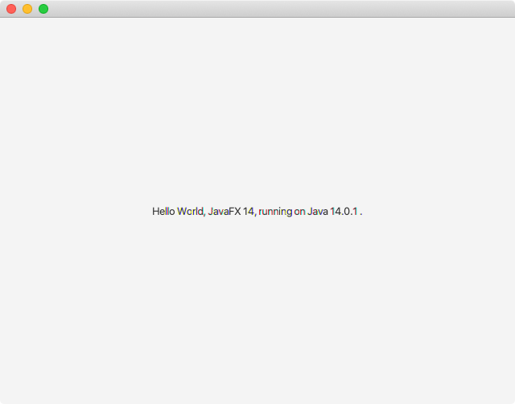

# JavaFX App Hello World Non-Modular 
This project is derived directly from [https://openjfx.io/openjfx-docs/](https://openjfx.io/openjfx-docs/) to create a **non-modular** JavaFX based Hello World application. Non-modular means the app is built to not use the Java Platform Module System (JPMS) (aka module path), but is using the older standard class path. 

This project has all three ways to compile and run the app consolidated into one place. The intent of this project lets anyone clone the project to quickly start a new JavaFX App project from scratch. 

   The following are common ways to compile and run the hello world JavaFX app:
> **Note:** To run build scripts it assumes the JDK, OpenJFX and build tools are installed. 
 - CLI - Command Line scripts such as compile-run-non-mod.sh 
 - Maven - Apache Maven (3.6.3 or later) using a JavaFX plugin (0.0.4)
 - Gradle - Gradle build tool (6.3 or later) using a JavaFX plugin (0.0.8)
   
  If you already have installed JDK (11 or later) and OpenJFX appropriately, this project contains three common ways to compile and run a JavaFX based Hello World Application. This project assumes the project is **not** using Java's new Java Platform Module System (JPMS). It will use the standard Java classpath to compile and run applications. 

# Install JDK
Before getting started you must install Java/JDK 11 or greater installed. There are numerous ways to install the latest Java JDK. After installing the JDK, you will need to set environment variables.
## Manual Installs
To manually install a JDK on a target platform you may have additional install instruction depending on what you've downloaded. For Example: On Redhat/CentOS Operating system using the rpm format involves admin permissions such as 'sudo'.
### Java JDK 11 or later 
Download the JDK to be installed on a target operating system.

Oracle download at [https://www.oracle.com/java/technologies/javase-downloads.html](https://www.oracle.com/java/technologies/javase-downloads.html)
 - Bellsoft [https://bell-sw.com/](https://bell-sw.com/)
 - Adopt a JDK [https://adoptopenjdk.net/](https://adoptopenjdk.net/)
 - The latest and greatest JDKs at java.net [https://jdk.java.net/](https://jdk.java.net/)
 - Azul Zulu - [https://www.azul.com/downloads/zulu-community/](https://www.azul.com/downloads/zulu-community/)
 - Amazon Corretto - [https://aws.amazon.com/corretto/](https://aws.amazon.com/corretto/)
 - GraalVM from Oracle at - [https://www.graalvm.org/downloads/](https://www.graalvm.org/downloads/)

 SAP JDK - [https://sap.github.io/SapMachine/](https://sap.github.io/SapMachine/)

|Java distro              | Location                          |
|-------------------------|-----------------------------------|
|Oracle                   |[https://www.oracle.com/java/technologies/javase-downloads.html](https://www.oracle.com/java/technologies/javase-downloads.html)|
|Bellsoft           | [https://bell-sw.com/](https://bell-sw.com/) |
|Adopt a JDK        | [https://adoptopenjdk.net/](https://adoptopenjdk.net/)|
|Java Development Kit builds           | [https://jdk.java.net/](https://jdk.java.net/) |
|Azul Zulu          | [https://www.azul.com/downloads/zulu-community/](https://www.azul.com/downloads/zulu-community/) |
|Amazon Corretto    | [https://aws.amazon.com/corretto/](https://aws.amazon.com/corretto/)|
|GraalVM (Oracle)   | [https://www.graalvm.org/downloads/](https://www.graalvm.org/downloads/)|
|SAP                | [https://sap.github.io/SapMachine/](https://sap.github.io/SapMachine/)|
### Manager Download tools
There are a number of software managers to download and use multiple JDKs.

 - SDK Man (All platforms)- [https://sdkman.io/](https://sdkman.io/)
 - HomeBrew (MacOS)- [https://brew.sh/](https://brew.sh/) 
 - Alternatives (Redhat/CentOS)
 - yum [https://access.redhat.com/solutions/9934](https://access.redhat.com/solutions/9934)
 - apt-get (Ubuntu) [https://help.ubuntu.com/community/AptGet/Howto](https://help.ubuntu.com/community/AptGet/Howto)

|Manager         | Platform                          |Location                         |Notes |
|----------------|-------------------------------|-----------------------------|------|
|SDK Man         |All major Platforms            |[https://sdkman.io/](https://sdkman.io/) |sdk install java 14.0.1-librca |
|HomeBrew        |MacOS                          |[https://brew.sh/](https://brew.sh/)|brew tap homebrew/cask-versions ; brew cask install java |
|Alternatives    |Redhat/CentOS                  |installed|update-alternatives --config javac|
|apt-get         |Ubuntu                         |installed|apt-get install oracle-java11-set-default-local|

> **Note:** Based on your OS or Platform make sure you have the correct admin permissions.

# Install OpenJFX
Go to [https://gluonhq.com/products/javafx/](https://gluonhq.com/products/javafx/) to obtain the latest binaries. Simple download and expand into any directory. For commercial long term support check out the folks at GluonHQ at [https://gluonhq.com/services/javafx-support/](https://gluonhq.com/services/javafx-support/)

>Gradle and Maven build scripts are using **OpenJFX version 14.0.1**.

# Setting up Environment variables
After installing the JDK and OpenJFX libraries environment variables need to be set for scripts to run properly.

```bash
$ export JAVA_HOME=<java installed path>
$ export PATH=$PATH:$JAVA_HOME/bin
$ export PATH_TO_FX=<path to javafx-sdk-14.0.1>/lib
```

# CLI Command Line
Using the command line (terminal) window you can compile and run the JavaFX Hello World Application.
## List build scripts
Listing files shows the following files and directories available.
```bash 
$ ls -l
total 40
-rw-r--r--  1 jdoe  staff  229 Apr 25 16:49 build.gradle
-rwxr-xr-x  1 jdoe  staff  285 Apr 25 17:23 compile-run-non-mod.bat
-rwxr-xr-x  1 jdoe  staff  293 Apr 25 17:21 compile-run-non-mod.sh
-rw-r--r--  1 jdoe  staff 1559 Apr 25 15:18 pom.xml
drwxr-xr-x  3 jdoe  staff   96 Apr 25 15:04 src
```
Here you'll see a the files **build.gradle, compile-run-non-mod.bat, compile-run-non-mod.sh, pom.xml** and the **src** directory. 

The hello world JavaFX application will follow the Maven's standard package directory structure like the following:
```bash
src
└── main
    └── java
        └── com
            └── helloworld
                └── HelloFX.java
    └── resources
        └── com
            └── helloworld
                ├── App_cs_CZ.properties
                ├── App_de.properties
                ├── App_en_US.properties
                ├── App_es.properties
                ├── App_fr.properties
                ├── App_ja.properties
                ├── App_ko_KR.properties
                └── App_zh.properties          
```
## Compile and Run Script 
A simple script that cleans up, compiles and runs the JavaFX application.
### Windows
```bash
C:> compile-run-non-mod.bat
```
### MacOS/Linux
```bash
$ ./compile-run-non-mod.sh
```
Output


## A Maven pom.xml
Maven script to build and run the application using maven.
### Windows
```bash
C:> mvn clean javafx:run
```
### MacOS/Linux
```bash
$ mvn clean javafx:run
```

## A Gradle build.gradle
A Gradle build script that cleans 
### Windows
```bash
C:> gradle wrapper
C:> gradlew clean build run
```

### MacOS/Linux
```bash
$ gradle wrapper
$ ./gradlew clean build run
```

# IntelliJ
VM options 
--module-path ${PATH_TO_FX} --add-modules javafx.controls com.helloworld.HelloFX